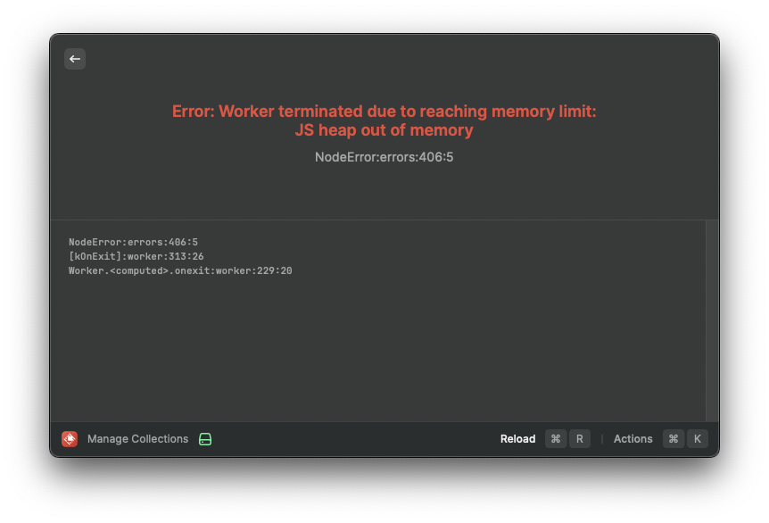

## Motivation

When studying I often find it troublesome to have a whole set of school notes, textbooks and documents open, and having to jump between each of them just to find a section referencing a concept that I had forgotten. What if there was an app that allowed you to quickly search through a set of documents at once?

This was the question I asked myself back in May of last year, about half a year after the release of ChatGPT and the rise of LLMs based applications. By this time, a quick search online will give you countless "Chat with your PDF" websites, and I realised I could quickly spin up a new ChatGPT wrapper with some predefined prompts and call it a day. However, being a contrarian (and overly ambitious), I wanted a solution that also met the following criteria:

1. It would have no chance of "hallucinating". I wanted it to point to specific sections of the document that would relevant to the query.
2. I should be able to see which parts of the document contained the relevant information, and be able open the document at that exact page for reference.

Additionally, the idea of having to pay for the usage of OpenAI's API and rely on an internet connection drove me away from this idea. A quick google search yielded an alternative solution: I could encode the contents of the documents using a sentence embedding model; A model that converts text into a vector of real numbers. We can then retrieve relevant results based on the similarity of the vectors of the search query and text.

While reading up on this topic, I also came across this [blog post](https://opensearch.org/blog/semantic-science-benchmarks#section-3-combination-methods) on the effectiveness of different search paradigms. This post made some conclusions that ended up guiding my approach to this problem. To quote:

>1. If a dataset contains a lot of keyword usage, BM25 works much better than neural retrievers. An example of such a dataset is one containing factory part numbers.
>2. If a dataset contains a lot of natural language, neural retrievers work much better than BM25. An example is data from a community forum.
>3. For datasets that contain both natural language and keywords, a combination of BM25 and neural retrievers works better. An example of such a dataset is one containing data for a clothing website that describes products using both natural language (product description) and numbers (product length, size, or weight).

Since my intended use case for this app would be to search through school notes and textbook PDFs, I expect the dataset to contain both natural language and keywords, which aligns with point 3 as mentioned above.

So over the course of a few days, I experimented with the [first iteration](https://github.com/kevin-pek/document-semantic-search) of this project, to see if this was even feasible. I tried using both [langchain](https://www.langchain.com/) and [haystack](https://haystack.deepset.ai/), and used [gradio](https://www.gradio.app/) for creating interface for the prototype. When PDF documents are uploaded on the interface, they will be parsed using PyMuPDF, encoded into a vector using a BERT model, and this will be stored and retrieved using FAISS. The cosine similarity between the vector representing the search query and the documents will then be used to rerank the search results obtained from the BM25 retriever.

Well, then suddenly life got in the way, and I left for summer school and got busy with the fall semester of university. I ended up taking a half a year hiatus from this project, but experiencing 2 school terms without this app had only made me want to develop this app idea further, into something that is easily usable and convenient for my studies.

## Rekindling the Spark

Somewhere along my fall semester, I also discovered [Raycast](https://www.raycast.com/), which is a launcher for MacOS that has greatly improved my productivity. This app replaces the default spotlight search bar in MacOS and provides many useful features, and even better, it has an API for you to develop your own extensions. This provided the perfect interface for me to create what I needed: If my extension works, I could just use `cmd` + `space` to start searching collections of school notes, significantly speeding up my workflow.

So I set out to create a second version of this app, which was going to be an extension for Raycast. It will be using a combination of semantic and keyword search, and still has to be runnable locally with a reasonable search speed and accuracy. My goal is to use BM25 in combination with a suitable neural retriever, similar to what was highlighted in the blog post above.

So my first idea was to look for an existing npm package that be used to implement this, and I stumbled upon this library called WinkJs.

## WinkJs

WinkJs is a library that provides most of the functionality I needed for this application, which includes a BM25 search engine implementation. So after spending an entire day hacking around, I managed to get BM25 retrieval working on a single paragraph PDF document. Eager to test it out on a more realistic example, I then opened a 97 page document. This was were I met my second major hurdle.



Raycast limits the amount of memory that my extension can use, and throws an error if it is exceeded. Unfortunately, the memory usage of my extension seems to exceed this limit every time I try to open a document of any substantial size (around 50 pages or more). This was because too much memory when parsing the text content of larger documents. I could restrict the app to only work on smaller sized documents, but to me this would defeat the entire purpose of the app.

I needed to parse files in a separate process to avoid the memory limit. A few ideas came to mind:

- Spawn a child process to handle file parsing and indexing.
- Offload the resource heavy operations such as file parsing, indexing and retrieval to an external process.

Since the first method seemed less daunting, it was the first option that I attempted.

### Creating Child Processes

I can start a child process in node to parse each document by having a self separate script that I can run in a separate file:

```typescript
// ingest.ts
const documents = await Promise.allSettled(
  files.map((file) => 
    new Promise<Document[]>((resolve, reject) => {
      const child = fork(path.join(__dirname, "loadFile.js"), [file])
 
      child.on('message', (doc: Document[]) => {
        resolve(doc)
      })
   
      child.on("error", (err) => {
        showFailureToast(`Unsupported file type for ${file}`);
        reject(err)
      })
     })
  )).then(r => r.flatMap(x => x.status == "fulfilled" ? x.value : [])
)


// loadFile.js
process.on("message", async (args: string) => {
  process.send(await load(args));
});

function load(file: string) {
  if (file.endsWith(".pdf")) {
    return await new PDFLoader(file).loadAndSplit();
  } else if (file.endsWith(".docx")) {
    return await new DocxLoader(file).loadAndSplit();
  } else {
    return await new TextLoader(file).loadAndSplit();
  }
};
```

I had planned to run separate node processes for handling files in order to limit the memory usage when loading large documents. However because of how code is bundled in Raycast, `loadFile.js` will not be bundled as part of the build, so it cannot be called in runtime.

There were also a few other issues with this solution:

- While this works for small pdf files, load times for larger pdf files and collections took minutes to load, which was way too long for a good user experience.
- Trying to load larger PDF files still resulted in memory usage exceeding the Javascript heap memory limit.
- Creating a new command for the extension purely for this function, which is not meant to be activated manually by the user, just doesn't make sense from a user experience perspective.

It became clear to me that for this option to be feasible for a general usage, I would have to introduce some form of queuing system to split up the PDF parsing processes in order to manage memory usage. This seemed to be introducing too much complexity for what should be a relatively simple task. So at this juncture I decided to take a few steps back and think about other possible solutions.

### Executable Binaries

The last option I made was to implement this document loading process using a more efficient language than javascript. To do this, I decided to implement the document parsing logic in Swift. So I got to work to learning the Swift programming language, and spending lots of time googling and asking ChatGPT how to do very basic things in Swift.

It was also around this time where I made a discovery that invalidated much of my work. The Natural Language framework provided by Apple provides most of the functionality needed for this app I was trying to make. This meant that all of the heavy lifting that my app needed could be done using native Swift libraries, which could solve all of the problems I have been facing over the past few weeks! After a few hours of tinkering, I got something very basic to try out:

```swift
import Foundation
import PDFKit
import NaturalLanguage

func getContent(pdfDoc: PDFDocument) {
    var tokens = [[String: Any]]()
    let tokeniser = NLTokenizer(unit: .paragraph)
    for pageIndex in 0..<pdfDoc.pageCount {
        guard let page = pdfDoc.page(at: pageIndex), let pageContent = page.string else { continue }
        tokeniser.string = pageContent
        tokeniser.enumerateTokens(in: pageContent.startIndex..<pageContent.endIndex) { tokenRange, _ in
            let word = pageContent[tokenRange]
            tokens.append(["word": word, "page": pageIndex + 1])
            return true
        }
    }
    if let jsonData = try? JSONSerialization.data(withJSONObject: tokens),
       let jsonString = String(data: jsonData, encoding: .utf8) {
        print(jsonString)
    }
}

if CommandLine.argc < 2 {
    print("Usage: FileParser <file_path>")
    exit(1)
}

let filePath = CommandLine.arguments[1]
if let pdfDoc = PDFDocument(url: URL(fileURLWithPath: filePath)) {
    getContent(pdfDoc: pdfDoc)
    exit(0)
} else {
    print("Failed to load PDF.")
    exit(1)
}
```

Turns out this should have been the solution from the start. Load times for documents became a lot faster, and the memory issues were resolved. Now I have a swift application that accepts a file path as a command line argument and outputs the JSON index created, which I can call from Raycast using the following code:

```javascript
const command = path.join(environment.assetsPath, "parse-file");
await chmod(command, "755");
const { stdout, exitCode } = await execa(command, [filepath]);
```

So began the second leg of my journey to develop my search app, this time diving into the Swift programming language and Apple's frameworks.
